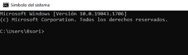

## Administra la nube como PRO

### Azure Portal

- Es un portal para navegadores
- El que hemos usado hasta ahora
- No soportado en navegadores moviles

-----------------------------------------------------------

### App de Azure

- Para acciones rapidas
- Para Android y IOS
- Solo puedes hacer recursos desde el azure cloud shell integrado

Para crear recursos en la app de azure en movil

- Le damos en Azure cloud shell

1.- escribimos **az** y nos despliega varios mensajes de welcome

-----------------------------------------------------------------------------------------

### Azure CLI

- Para instalar y manejar azure desde tu cumpo.

- Para instalar y manejar azure desde tu compu .

- windows, linux, mac y azure cloud shell.

- **NO SE PUEDE INSTALAN EN chrome book** no es compatible.

1.- Una ves que lo instales, nos iremos al CMD.

2.- Y aqui escribiremos **az login**.

3.- Lo que hara es abrir una pestaña, para iniciar sesion en Azure.

4.- Pondremos el comando **az** para checar que ya estamos.

5.- Vamos a crear un grupo de recursos.

6.- Ponemos el comando **az group create** **--location westus** **--resource-group** **sesion7**.

7.- Cuando te aparece **provisioningState:** **"succeded"** significa que esta hecho y sin error.

8.- Ahora vamonos al [Portal de Azure](https://portal.azure.com/#home) .

9.- Nos iremos a nuestro grupo de recursos para ver que si se haya creado.

10.- Esto puede tardar en que aparezca.

11.- Y esto es Azure CLI.

--------------------------------------------------------------------------------------------

### Azure cloud shell

- Este funciona en cualquier navegador de escritorio.

- Terminal de comandos en la nube.

- Para velocidad, acceso pos ssh, uso con git y mucho mas.

- Es el azure CLI corriendo en la nube.

---------------------------------------------------------------------------------------------

## PowerShell

***No es para azure, es una linea de comando de windows***.

- Para automatizar tarea por linea de comando.

-Windows, linuz, mac, docker y procesadores ARM.

-No chromebook.

***Dentro del powershell existe el azure powershell***.

----------------------------------------------------------------------------------------------
